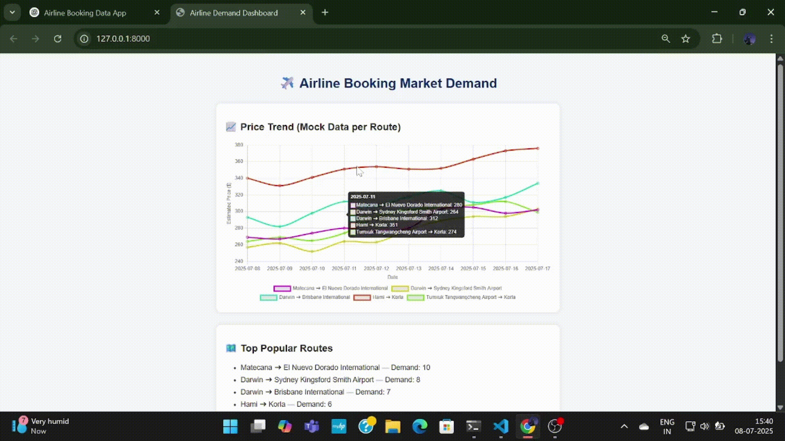

# ✈️ Airline Market Demand Web App

A FastAPI-based interactive dashboard that fetches, processes, and visualizes real-time airline demand trends using the **AviationStack API**.

This tool is designed to help hospitality and travel-related businesses (e.g., hostels, travel agencies) analyze air travel market trends, identify high-demand routes, and understand price fluctuations.

---

### 🎥 Demo

> A quick preview of the working dashboard:



---

## 🔧 Features

- 🌍 **Live API Integration**: Fetches real-time flight data from the AviationStack API  
- 📊 **Trend Visualization**: Displays estimated price trends over 10 days using Chart.js  
- 🛫 **Route Insights**: Identifies the most popular routes based on flight frequency  
- 📈 **Dynamic Charting**: Interactive line charts with tooltips for route-wise pricing  
- 🧼 **Data Cleaning & Processing**: Flight data is filtered and sorted using pandas  
- 🎨 **Frontend with Jinja2**: Clean, responsive HTML dashboard styled with CSS  

---

## 📦 Tech Stack

| Backend   | Frontend     | Data/API           |
|-----------|--------------|--------------------|
| FastAPI   | HTML, CSS    | AviationStack API  |
| Uvicorn   | Chart.js     | pandas             |
| Jinja2    | Vanilla JS   | datetime, requests |

---

## 🚀 Run Locally (with Conda & FastAPI)

```bash
# 1️⃣ Clone the repository
git clone https://github.com/shashikanthshadow/airline-demand-dashboard.git
cd airline-demand-dashboard

# 2️⃣ Create and activate the Conda environment
conda env create -f environment.yml
conda activate airlineapp

🔑 3️⃣ Get Your Free API Key
This app uses the AviationStack API to fetch real-time flight data.

Visit https://aviationstack.com/

Click "Sign Up Free"

Once signed in, go to your Dashboard

Copy your API Key

✍️ 4️⃣ Add Your API Key
Open the main.py file and replace this line:

python
Copy
Edit
API_KEY = "your_actual_api_key_here"
with your own key.

🚀 5️⃣ Run the FastAPI Server
bash
Copy
Edit
uvicorn main:app --reload
Then visit: http://127.0.0.1:8000/

You’ll see the dashboard displaying live route demand and price trend charts!

📁 Project Structure
cpp
Copy
Edit
airline-demand-dashboard/
├── main.py
├── templates/
│   └── index.html
├── static/
│   └── style.css
├── assets/
│   └── demo.gif
├── environment.yml
├── README.md
🧠 Author
Shashikanth Rao
GitHub: @shashikanthshadow


